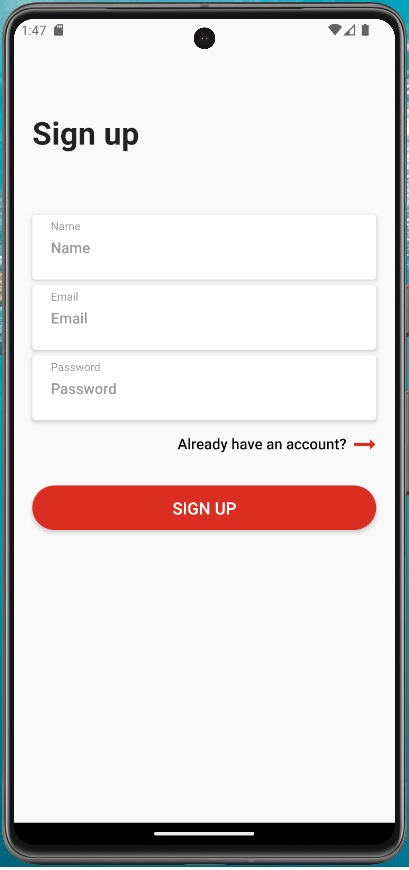
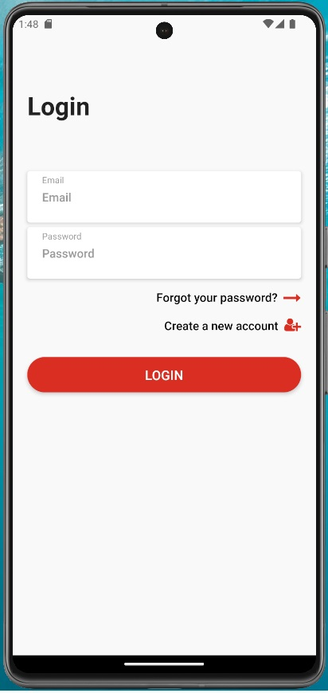
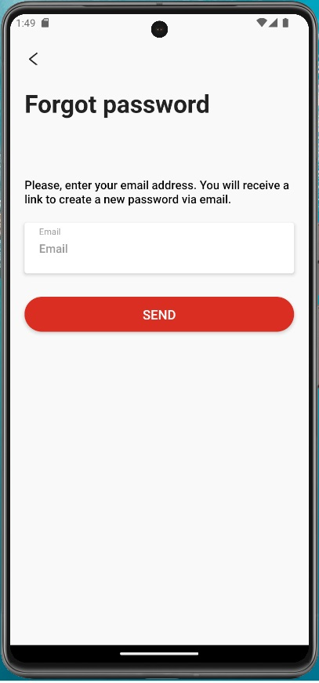
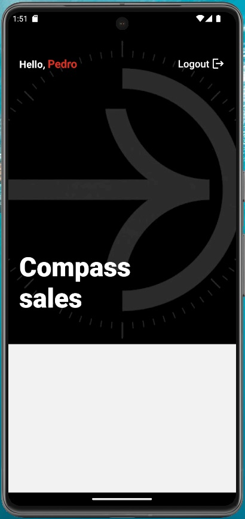

# Second Challenge - Compass Sales App
## Author: Pedro Henrique de Avila Tonin

### How to run the project
You need to have Node.js installed to run the application.
#### Using the .bat Script (for Windows Only)
1. First of all, to visualize the application, you will need a mobile device emulator with Android 13 "Tiramisu" running on it.
2. Then, you have to download the zip file that contains the source code and extract it to a directory, or you can simply clone this repository using:
```bash
git clone https://github.com/PepeTonin/projeto-compass_sales-pedro-henrique-de-avila-tonin-squad07.git
```

3. **With the emulator open**, just run the file "autoRun.bat" to execute the scripts.


#### Manual Setup
1. First of all, to visualize the application, you will need a mobile device emulator with Android 13 "Tiramisu" running on it, or an Android smartphone with the "Expo Go" app installed. Make sure everything is set up before continuing.
2. Then, you have to download the zip file that contains the source code and extract it to a directory, or you can simply clone this repository using:
```bash
git clone https://github.com/PepeTonin/projeto-compass_sales-pedro-henrique-de-avila-tonin-squad07.git
```
3. After that, you have to run `npm install` in the folder where you downloaded or cloned the project. This may take a while.

**To run in an emulator**
4. When the installation finishes, you can run the command below, with the emulator open, to start the app in it:
```bash
npx expo start --android
```

**To run on a real Android device**
4. When the installation finishes, you can run the command below:
```bash
npx expo start
```
5. In the terminal, you will see a QR code. Just scan it with the "Expo Go" app, and the project will run on your device.

### About the App
The application was developed using [Expo](https://docs.expo.dev/). Other libraries and tools that were used to construct this project are:
* From the Expo workflow:
  - [Expo Font](https://docs.expo.dev/versions/latest/sdk/font/)
  - [Expo SplashScreen](https://docs.expo.dev/versions/latest/sdk/splash-screen/)
  - [Expo StatusBar](https://docs.expo.dev/versions/latest/sdk/status-bar/)
  - [Expo Vector Icons](https://docs.expo.dev/guides/icons/)
* [React Navigation](https://reactnavigation.org/);
* [React Native Async Storage](https://react-native-async-storage.github.io/async-storage/docs/install/);
* [Axios](https://axios-http.com/);
* [Firebase](https://firebase.google.com/docs);

For now, the application only has an authentication area where the user can create an account, log in with an existing account, or recover a forgotten password for an existing account.
The authentication is managed by [Firebase Auth REST API](https://firebase.google.com/docs/reference/rest/auth).
All the screens of the project are listed below.

Sign up


Login


Forgot password


Main screen (first page the user see when login)



